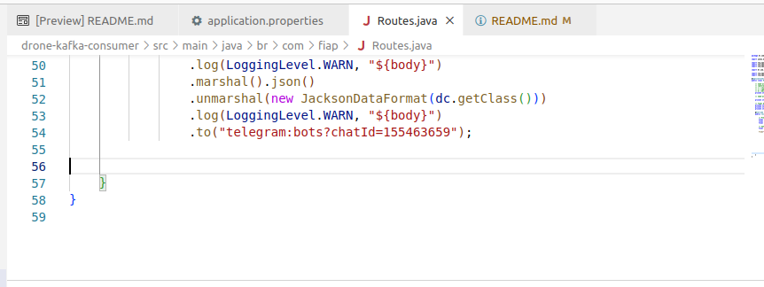
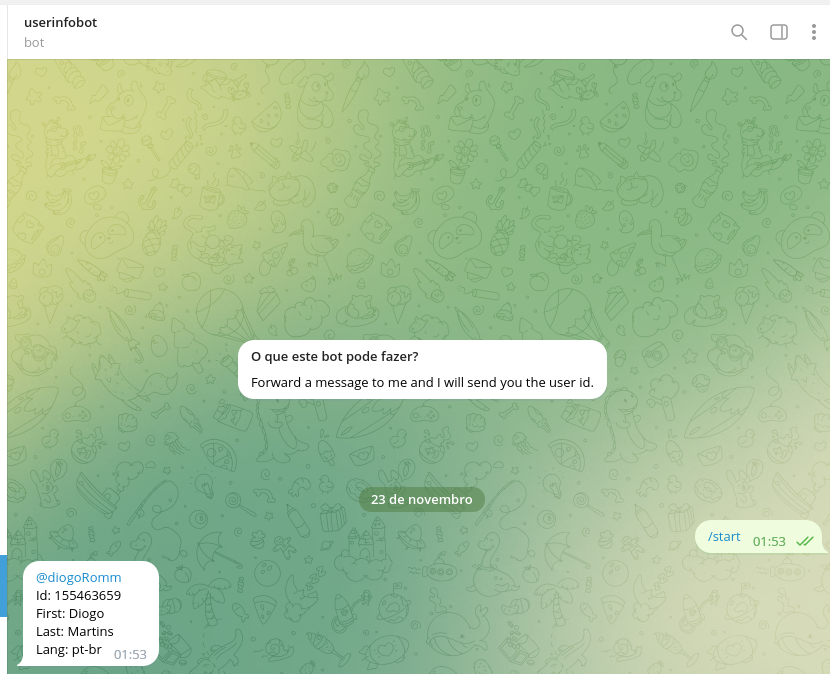
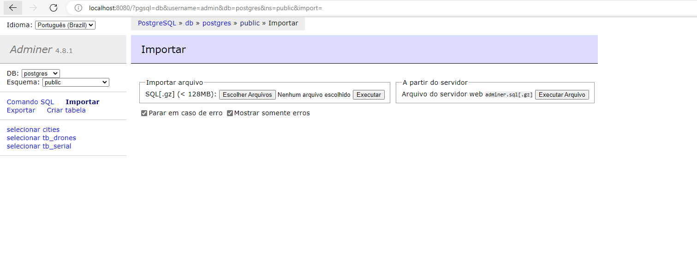
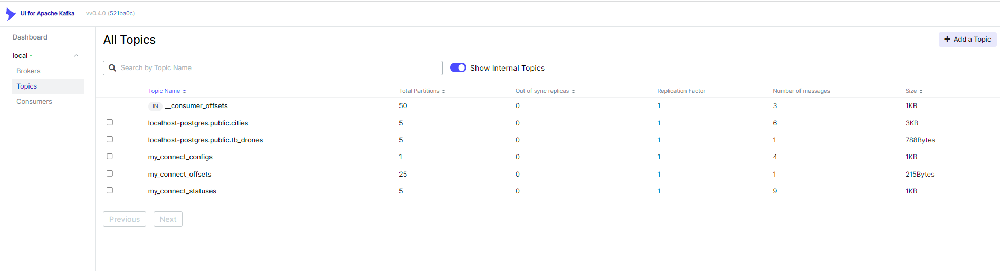

# FIAP - Trabalho de conclusão - 1SCJRBB -  Integration e Development Tools.

## Trabalho para integração de microsservices

Esse é o projeto de conclusão da disciplina 1SCJRBB -  Integration e Development Tools. Sua função é a integrar um microsserviço de gerenciamento de Drones com um microsserviço que gera alertas a depender do determinados parâmetros.

Os Alertas são enviados para o seguinte chat bot do telegram:

[DronesTrackBot](https://t.me/DronesTrackBot)

## Pré requisitos

* Sistema operacional compatível com Docker. 
	* Todo projeto foi construindo no Ubuntu, pode apresentar problemas de conectividade em alguns serviços caso usado em WSL2.

* Docker-compose para startar os serviços.

* Recomendado uso de um client para execução de queries, por exemplo [DBeaver](https://dbeaver.io/download/).
	* para comodidade na construção do Postgress foi disponibilizado um client do ADMINER que execute em Localhost.

* Java 11 com MVN

* NodeJS acima do 16 com NPM. 

## Envio de alertas para o chatBot no Telegram:

* Será necessário alterar alguns dados sobre o chat ID na seguinte classe:

[Routes.java](drone-kafka-consumer/src/main/java/br/com/fiap/Routes.java)

Na linha 54 onde é solicitado o Chat Id.



Para conseguir o seu próprio chatId é necessário no telegram entrar no seguinte bot:

[userinfobot](https://t.me/userinfobot)




## Documentação das tecnologias


1. [Debezium-PostgresSql](https://debezium.io/documentation/reference/stable/connectors/postgresql.html) 
	* em resumo o Debezium é um conector kafka Open Source utilizado para Change Data Capture (CDC) - Captura de mudança de dados.
	
2. [Quarkus](https://quarkus.io/about/) + [Camel](https://camel.apache.org/manual/faq/what-is-camel.html)
	* Quarkus é um framework para java Cloud Native desenvolvido para aplicações java que vão executar na núvem e compatível com a arquitetura Servless. O Apache Camel é um [ENTERPRISE INTEGRATION PATTERNS](https://camel.apache.org/components/3.18.x/eips/enterprise-integration-patterns.html)

## Components

1. [Postgres container](./postgres-docker/docker-compose.yml) Configurado no modo de uso [logical decoding](https://www.postgresql.org/docs/current/logicaldecoding-explanation.html), Seguindo a seguinte documentação do Debezium: [Debezium Postgres Connector recomendation](https://debezium.io/documentation/reference/stable/connectors/postgresql.html).


4.  Implementação 
  a. [Kafka + Zookeeper + KafkaConnect + KafkaUI containers](./kafka-docker/docker-compose.yml)

## Executando

### 1. Executando o Container Postgress
* No dirretório Postgres-docker execute o docker-compose
```shell script
cd postgres-docker
docker-compose up -d
cd ..
```

* Para comodidade o ADMINER está exposto no seguinte endereço: http://localhost:8080 Com as seguintes credenciais. [docker-compose.yml](./postgres-docker/docker-compose.yml) 
* Selecione a DataBase **postgres** e o Esquema público. **public**
* Na Opção importar, importe o arquivo [create_tables.sql](postgres-docker\sql\create_tables.sql)



### 2. Executando Kafka + Debezium
* Navegue até a pasta [kafka-docker](./kafka-docker/) e execute o docker-compose up
```shell script
cd kafka-docker
docker-compose up -d
cd ..
```
* Execute Kafka-Connect setup para criar um conector do postgres com as configurações do [connector.json](./kafka-docker/connector.json).
  * ATENÇÃO!! O IP contido em     "database.hostname": "localhost",   deve ser substituído pelo ip local da sua máquina

```shell script
cd kafka-docker
./setconnector.sh
cd ..
```

Após a execução do script é possível na interface gráfica do kafka verificar e gerenciar os tópicos.

[Tópicos kafka na UI](http://localhost:8180/ui/clusters/local/topics)



Após isso o kafka estará totalmente configurado e produzindo mensagens kafka com os dados inseridos nas tabelas. 

## Executando a aplicação web e subscritor:

### OBS: Uma vez que a aplicação não foi containerizada e tanto o kakfa quanto o banco executam em docker local os microsserviços da aplicação Web, o MS de CRUD das tabelas e o Kafka consumer devem ser executados localmente em modo dev. 

* 1 CRUD das tabelas.

No diretório drone-crud execute mvn quarkus:dev. O serviço de Crud irá responder em:

localhost:8095.

* 2 kafka Consumer

No diretório drone-kafka-consumer também execute mvn quarkus:dev. o Serviço de subscrição irá responder na porta: 

localhost:8093.

ATENÇÃO!! 

O endereço do broker do kafka deve ser substituído no application.properties.

[application.properties](drone-kafka-consumer/src/main/resources/application.properties)


* 3 Aplicação web

Diretório: webApp/drones-web

executar npm install e logo em seguida npm start.

A aplicação vai responder em localhost:4200


## Backlog
### Neste projeto

1. Automatizar em um único docker-compose  esse projeto.

